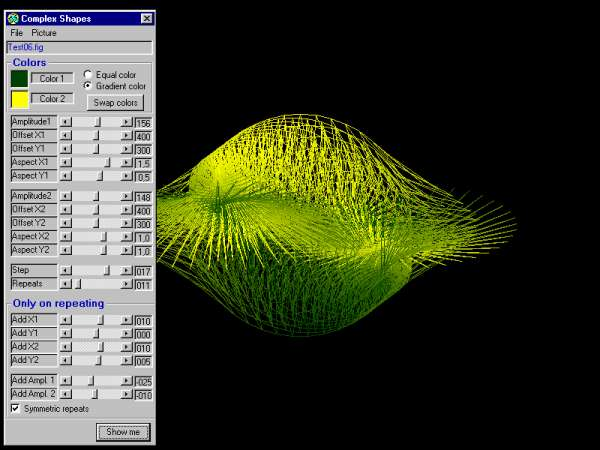



## Complex Shapes

### Description

With this prog. you can design very complex shapes of any kind, and save them as figure or as bitmap. The pictures I create here are used by me in a very big graphical program. I thought it can do some good to graphics lovers. Enjoy !
 
### More Info
 

             |
---                |---
**Submitted On**   |2002-02-10 00:24:56
**By**             |[stephane swertvaegher](https://github.com/Planet-Source-Code/PSCIndex/blob/master/ByAuthor/stephane-swertvaegher.md)
**Level**          |Intermediate
**User Rating**    |4.9 (79 globes from 16 users)
**Compatibility**  |VB 6\.0
**Category**       |[Complete Applications](https://github.com/Planet-Source-Code/PSCIndex/blob/master/ByCategory/complete-applications__1-27.md)
**World**          |[Visual Basic](https://github.com/Planet-Source-Code/PSCIndex/blob/master/ByWorld/visual-basic.md)
**Archive File**   |[Complex\_Sh54257292002\.zip](https://github.com/Planet-Source-Code/stephane-swertvaegher-complex-shapes__1-31645/archive/master.zip)

